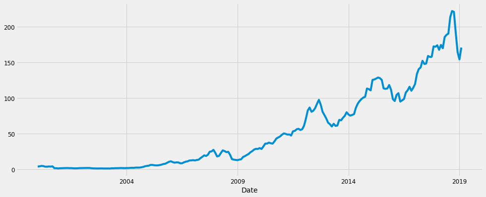
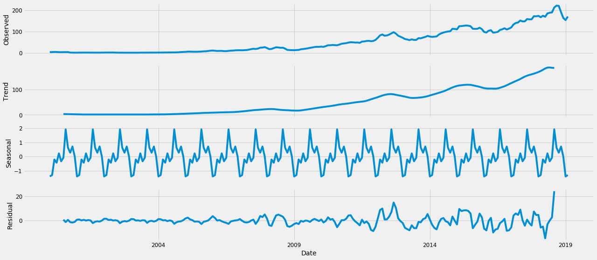
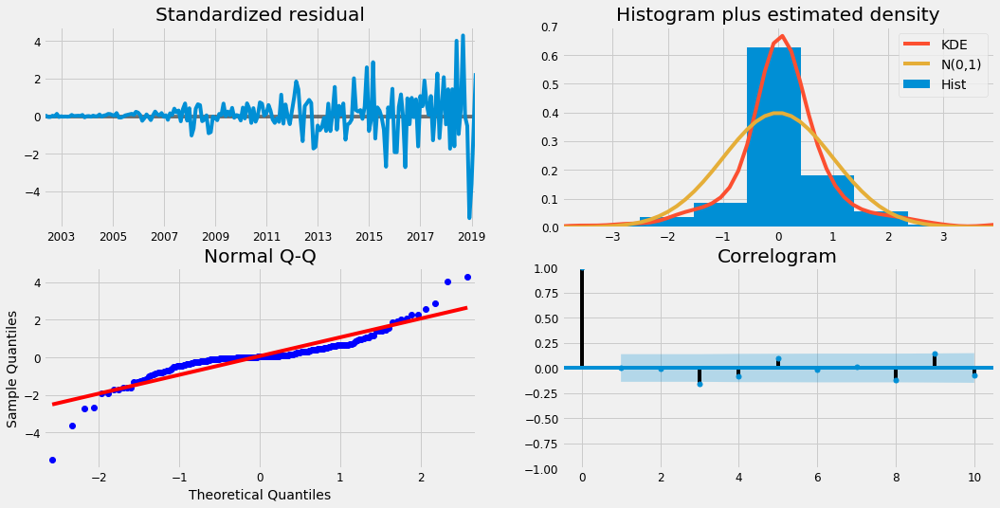
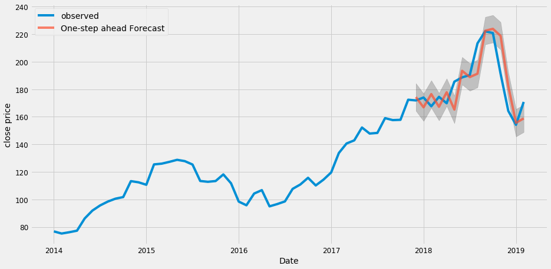
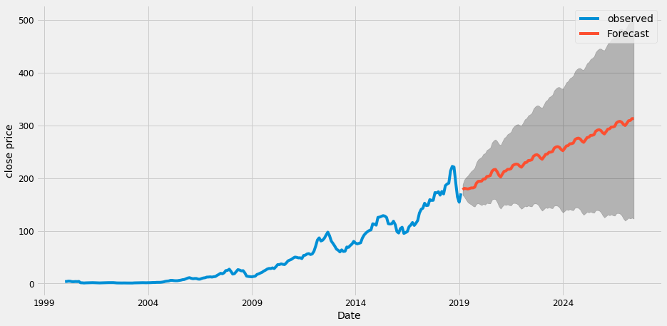

## Stock Market Forecasting

Investment firms, hedge funds and even individuals have been using financial models to better understand market behavior and make profitable investments and trades. A wealth of information is available in the form of historical stock prices and company performance data, suitable for machine learning algorithms to process.


```python
import warnings
import itertools
import numpy as np
import matplotlib.pyplot as plt
warnings.filterwarnings("ignore")
plt.style.use('fivethirtyeight')
import pandas as pd
import statsmodels.api as sm
import matplotlib

matplotlib.rcParams['axes.labelsize'] = 14
matplotlib.rcParams['xtick.labelsize'] = 12
matplotlib.rcParams['ytick.labelsize'] = 12
matplotlib.rcParams['text.color'] = 'k'
```

We are going to do time series analysis and forecasting for stock market.


```python
df1 = pd.read_csv('Apple.csv')
df2= pd.read_csv('amazon.csv')
stock=df1
```


```python
stock.head()
```


<div>
<style scoped>
    .dataframe tbody tr th:only-of-type {
        vertical-align: middle;
    }

    .dataframe tbody tr th {
        vertical-align: top;
    }

    .dataframe thead th {
        text-align: right;
    }
</style>
<table border="1" class="dataframe">
  <thead>
    <tr style="text-align: right;">
      <th></th>
      <th>Date</th>
      <th>High</th>
      <th>Low</th>
      <th>Open</th>
      <th>Close</th>
      <th>Volume</th>
      <th>Adj Close</th>
    </tr>
  </thead>
  <tbody>
    <tr>
      <th>0</th>
      <td>2000-01-03</td>
      <td>4.017857</td>
      <td>3.631696</td>
      <td>3.745536</td>
      <td>3.997768</td>
      <td>133949200.0</td>
      <td>2.665724</td>
    </tr>
    <tr>
      <th>1</th>
      <td>2000-01-04</td>
      <td>3.950893</td>
      <td>3.613839</td>
      <td>3.866071</td>
      <td>3.660714</td>
      <td>128094400.0</td>
      <td>2.440975</td>
    </tr>
    <tr>
      <th>2</th>
      <td>2000-01-05</td>
      <td>3.948661</td>
      <td>3.678571</td>
      <td>3.705357</td>
      <td>3.714286</td>
      <td>194580400.0</td>
      <td>2.476697</td>
    </tr>
    <tr>
      <th>3</th>
      <td>2000-01-06</td>
      <td>3.821429</td>
      <td>3.392857</td>
      <td>3.790179</td>
      <td>3.392857</td>
      <td>191993200.0</td>
      <td>2.262367</td>
    </tr>
    <tr>
      <th>4</th>
      <td>2000-01-07</td>
      <td>3.607143</td>
      <td>3.410714</td>
      <td>3.446429</td>
      <td>3.553571</td>
      <td>115183600.0</td>
      <td>2.369532</td>
    </tr>
  </tbody>
</table>
</div>


```python
stock['Date'].min()
```


    '2000-01-03'


```python
stock['Date'].max()
```


    '2019-02-15'


```python
#stock['Date']=pd.to_datetime(df.Date,format='%Y%m%d', errors='ignore')
```


```python
stock.Date = pd.to_datetime(stock.Date, format='%Y%m%d', errors='ignore')

```

## Data preprocessing

This step includes removing columns we do not need, check missing values, aggregate sales by date and so on.


```python
cols = ['High', 'Low', 'Open', 'Volume', 'Adj Close']
stock.drop(cols, axis=1, inplace=True)
stock = stock.sort_values('Date')
```


```python
stock.isnull().sum()
```


    Date     0
    Close    0
    dtype: int64


```python
stock = stock.groupby('Date')['Close'].sum().reset_index()
```


```python
stock.head()
```


<div>
<style scoped>
    .dataframe tbody tr th:only-of-type {
        vertical-align: middle;
    }

    .dataframe tbody tr th {
        vertical-align: top;
    }

    .dataframe thead th {
        text-align: right;
    }
</style>
<table border="1" class="dataframe">
  <thead>
    <tr style="text-align: right;">
      <th></th>
      <th>Date</th>
      <th>Close</th>
    </tr>
  </thead>
  <tbody>
    <tr>
      <th>0</th>
      <td>2000-01-03</td>
      <td>3.997768</td>
    </tr>
    <tr>
      <th>1</th>
      <td>2000-01-04</td>
      <td>3.660714</td>
    </tr>
    <tr>
      <th>2</th>
      <td>2000-01-05</td>
      <td>3.714286</td>
    </tr>
    <tr>
      <th>3</th>
      <td>2000-01-06</td>
      <td>3.392857</td>
    </tr>
    <tr>
      <th>4</th>
      <td>2000-01-07</td>
      <td>3.553571</td>
    </tr>
  </tbody>
</table>
</div>


## Indexing with time series data


```python
stock = stock.set_index('Date')
stock.index
```


    Index(['2000-01-03', '2000-01-04', '2000-01-05', '2000-01-06', '2000-01-07',
           '2000-01-10', '2000-01-11', '2000-01-12', '2000-01-13', '2000-01-14',
           ...
           '2019-02-04', '2019-02-05', '2019-02-06', '2019-02-07', '2019-02-08',
           '2019-02-11', '2019-02-12', '2019-02-13', '2019-02-14', '2019-02-15'],
          dtype='object', name='Date', length=4811)


Our current datetime data can be tricky to work with, therefore, we will use the averages daily sales value for that month instead, and we are using the start of each month as the timestamp.


```python
#y = stock['Close'].resample('M').mean()
stock.index = pd.to_datetime(stock.index)

monthly_mean = stock.Close.resample('M').mean()

```

Have a quick peek 2017 sales data.


```python
monthly_mean['2018':]
```


    Date
    2018-01-31    174.005237
    2018-02-28    167.638947
    2018-03-31    174.496192
    2018-04-30    169.834287
    2018-05-31    185.536818
    2018-06-30    188.621429
    2018-07-31    190.311429
    2018-08-31    213.346089
    2018-09-30    222.073685
    2018-10-31    220.845652
    2018-11-30    191.235714
    2018-12-31    164.266317
    2019-01-31    154.166190
    2019-02-28    170.808545
    Freq: M, Name: Close, dtype: float64


## Visualizing Close time series data


```python
monthly_mean.plot(figsize=(15, 6))
plt.show()
```





Some distinguishable patterns appear when we plot the data. The time-series has seasonality pattern

We can also visualize our data using a method called time-series decomposition that allows us to decompose our time series into three distinct components: trend, seasonality, and noise.


```python
from pylab import rcParams
rcParams['figure.figsize'] = 18, 8

decomposition = sm.tsa.seasonal_decompose(monthly_mean, model='additive')
fig = decomposition.plot()
plt.show()
```





The plot above clearly shows that the Close price is unstable, along with its obvious seasonality.

## Time series forecasting with ARIMA

We are going to apply one of the most commonly used method for time-series forecasting, known as ARIMA, which stands for Autoregressive Integrated Moving Average.

Parameter Selection for the ARIMA Time Series Model. ARIMA models are denoted with the notation `ARIMA(p, d, q)`. These three parameters account for seasonality, trend, and noise in data:`


```python
p = d = q = range(0, 2)
pdq = list(itertools.product(p, d, q))
seasonal_pdq = [(x[0], x[1], x[2], 12) for x in list(itertools.product(p, d, q))]

print('Examples of parameter combinations for Seasonal ARIMA...')
print('SARIMAX: {} x {}'.format(pdq[1], seasonal_pdq[1]))
print('SARIMAX: {} x {}'.format(pdq[1], seasonal_pdq[2]))
print('SARIMAX: {} x {}'.format(pdq[2], seasonal_pdq[3]))
print('SARIMAX: {} x {}'.format(pdq[2], seasonal_pdq[4]))
```

    Examples of parameter combinations for Seasonal ARIMA...
    SARIMAX: (0, 0, 1) x (0, 0, 1, 12)
    SARIMAX: (0, 0, 1) x (0, 1, 0, 12)
    SARIMAX: (0, 1, 0) x (0, 1, 1, 12)
    SARIMAX: (0, 1, 0) x (1, 0, 0, 12)
    


```python
l_param = []
l_param_seasonal=[]
l_results_aic=[]
for param in pdq:
    for param_seasonal in seasonal_pdq:
        try:
            mod = sm.tsa.statespace.SARIMAX(monthly_mean,
                                            order=param,
                                            seasonal_order=param_seasonal,
                                            enforce_stationarity=False,
                                            enforce_invertibility=False)

            results = mod.fit()

            print('ARIMA{}x{}12 - AIC:{}'.format(param, param_seasonal, results.aic))
            
            l_param.append(param)
            l_param_seasonal.append(param_seasonal)
            l_results_aic.append(results.aic)
        except:
            continue
```

    ARIMA(0, 0, 0)x(0, 0, 0, 12)12 - AIC:2643.5019979710623
    ARIMA(0, 0, 0)x(0, 0, 1, 12)12 - AIC:2309.3344747851397
    ARIMA(0, 0, 0)x(0, 1, 0, 12)12 - AIC:1951.0204253540373
    ARIMA(0, 0, 0)x(0, 1, 1, 12)12 - AIC:1856.0314687281086
    ARIMA(0, 0, 0)x(1, 0, 0, 12)12 - AIC:1890.7953591460857
    ARIMA(0, 0, 0)x(1, 0, 1, 12)12 - AIC:1802.9557150994888
    ARIMA(0, 0, 0)x(1, 1, 0, 12)12 - AIC:1863.8878931058043
    ARIMA(0, 0, 0)x(1, 1, 1, 12)12 - AIC:1819.3731566966417
    ARIMA(0, 0, 1)x(0, 0, 0, 12)12 - AIC:2329.0358209780316
    ARIMA(0, 0, 1)x(0, 0, 1, 12)12 - AIC:2023.396311267176
    ARIMA(0, 0, 1)x(0, 1, 0, 12)12 - AIC:1696.2018573613307
    ARIMA(0, 0, 1)x(0, 1, 1, 12)12 - AIC:1614.3277463613813
    ARIMA(0, 0, 1)x(1, 0, 0, 12)12 - AIC:1665.565311522994
    ARIMA(0, 0, 1)x(1, 0, 1, 12)12 - AIC:1570.4018772124139
    ARIMA(0, 0, 1)x(1, 1, 0, 12)12 - AIC:1628.2409469481017
    ARIMA(0, 0, 1)x(1, 1, 1, 12)12 - AIC:1617.4495655101296
    ARIMA(0, 1, 0)x(0, 0, 0, 12)12 - AIC:1398.2204803534116
    ARIMA(0, 1, 0)x(0, 0, 1, 12)12 - AIC:1334.9216709589466
    ARIMA(0, 1, 0)x(0, 1, 0, 12)12 - AIC:1452.2591559150064
    ARIMA(0, 1, 0)x(0, 1, 1, 12)12 - AIC:1285.508158791367
    ARIMA(0, 1, 0)x(1, 0, 0, 12)12 - AIC:1339.520670259119
    ARIMA(0, 1, 0)x(1, 0, 1, 12)12 - AIC:1336.3565267210229
    ARIMA(0, 1, 0)x(1, 1, 0, 12)12 - AIC:1326.9828768745742
    ARIMA(0, 1, 0)x(1, 1, 1, 12)12 - AIC:1279.8508499740478
    ARIMA(0, 1, 1)x(0, 0, 0, 12)12 - AIC:1368.7551058574609
    ARIMA(0, 1, 1)x(0, 0, 1, 12)12 - AIC:1306.0809321725253
    ARIMA(0, 1, 1)x(0, 1, 0, 12)12 - AIC:1427.6836685025587
    ARIMA(0, 1, 1)x(0, 1, 1, 12)12 - AIC:1260.8847866563428
    ARIMA(0, 1, 1)x(1, 0, 0, 12)12 - AIC:1315.8514312501654
    ARIMA(0, 1, 1)x(1, 0, 1, 12)12 - AIC:1307.6526338181916
    ARIMA(0, 1, 1)x(1, 1, 0, 12)12 - AIC:1306.685537980573
    ARIMA(0, 1, 1)x(1, 1, 1, 12)12 - AIC:1256.2555468308506
    ARIMA(1, 0, 0)x(0, 0, 0, 12)12 - AIC:1401.5892856842395
    ARIMA(1, 0, 0)x(0, 0, 1, 12)12 - AIC:1335.1540397592144
    ARIMA(1, 0, 0)x(0, 1, 0, 12)12 - AIC:1454.3103391806694
    ARIMA(1, 0, 0)x(0, 1, 1, 12)12 - AIC:1292.9381750556627
    ARIMA(1, 0, 0)x(1, 0, 0, 12)12 - AIC:1334.7357178024079
    ARIMA(1, 0, 0)x(1, 0, 1, 12)12 - AIC:1336.5944886941802
    ARIMA(1, 0, 0)x(1, 1, 0, 12)12 - AIC:1326.6562712103746
    ARIMA(1, 0, 0)x(1, 1, 1, 12)12 - AIC:1287.2469273042852
    ARIMA(1, 0, 1)x(0, 0, 0, 12)12 - AIC:1373.8286397835113
    ARIMA(1, 0, 1)x(0, 0, 1, 12)12 - AIC:1309.187658984732
    ARIMA(1, 0, 1)x(0, 1, 0, 12)12 - AIC:1426.8544852902246
    ARIMA(1, 0, 1)x(0, 1, 1, 12)12 - AIC:1268.3279801554547
    ARIMA(1, 0, 1)x(1, 0, 0, 12)12 - AIC:1313.9990702944035
    ARIMA(1, 0, 1)x(1, 0, 1, 12)12 - AIC:1310.8382813705161
    ARIMA(1, 0, 1)x(1, 1, 0, 12)12 - AIC:1304.9810699599425
    ARIMA(1, 0, 1)x(1, 1, 1, 12)12 - AIC:1263.8179991733687
    ARIMA(1, 1, 0)x(0, 0, 0, 12)12 - AIC:1375.2911367676334
    ARIMA(1, 1, 0)x(0, 0, 1, 12)12 - AIC:1313.345389587852
    ARIMA(1, 1, 0)x(0, 1, 0, 12)12 - AIC:1432.7125162717587
    ARIMA(1, 1, 0)x(0, 1, 1, 12)12 - AIC:1267.5025830690413
    ARIMA(1, 1, 0)x(1, 0, 0, 12)12 - AIC:1312.950560627827
    ARIMA(1, 1, 0)x(1, 0, 1, 12)12 - AIC:1314.9490408714069
    ARIMA(1, 1, 0)x(1, 1, 0, 12)12 - AIC:1301.5504835177653
    ARIMA(1, 1, 0)x(1, 1, 1, 12)12 - AIC:1263.9225837342588
    ARIMA(1, 1, 1)x(0, 0, 0, 12)12 - AIC:1369.9459940239121
    ARIMA(1, 1, 1)x(0, 0, 1, 12)12 - AIC:1307.6674140471905
    ARIMA(1, 1, 1)x(0, 1, 0, 12)12 - AIC:1428.2281314390366
    ARIMA(1, 1, 1)x(0, 1, 1, 12)12 - AIC:1262.2342105167386
    ARIMA(1, 1, 1)x(1, 0, 0, 12)12 - AIC:1312.3853477851167
    ARIMA(1, 1, 1)x(1, 0, 1, 12)12 - AIC:1309.2854786259286
    ARIMA(1, 1, 1)x(1, 1, 0, 12)12 - AIC:1302.3222861333356
    ARIMA(1, 1, 1)x(1, 1, 1, 12)12 - AIC:1258.1164761866635
    


```python
minimum=l_results_aic[0]
for i in l_results_aic[1:]:
    if i < minimum: 
        minimum = i
i=l_results_aic.index(minimum)
```


```python
mod = sm.tsa.statespace.SARIMAX(monthly_mean,
                                order=l_param[i],
                                seasonal_order=l_param_seasonal[i],
                                enforce_stationarity=False,
                                enforce_invertibility=False)

results = mod.fit()

print(results.summary().tables[1])
```

    ==============================================================================
                     coef    std err          z      P>|z|      [0.025      0.975]
    ------------------------------------------------------------------------------
    ma.L1          0.3166      0.042      7.485      0.000       0.234       0.399
    ar.S.L12      -0.3339      0.057     -5.863      0.000      -0.446      -0.222
    ma.S.L12      -0.7985      0.059    -13.560      0.000      -0.914      -0.683
    sigma2        25.9474      1.292     20.077      0.000      23.414      28.480
    ==============================================================================
    


```python
results.plot_diagnostics(figsize=(16, 8))
plt.show()
```





## Validating forecasts

To help us understand the accuracy of our forecasts, we compare predicted Close to real close price of the time series, and we set forecasts to start at `2017-12-31` to the end of the data.


```python
pred = results.get_prediction(start=pd.to_datetime('2017-12-31'), dynamic=False)
pred_ci = pred.conf_int()

ax = monthly_mean['2014':].plot(label='observed')
pred.predicted_mean.plot(ax=ax, label='One-step ahead Forecast', alpha=.7, figsize=(14, 7))

ax.fill_between(pred_ci.index,
                pred_ci.iloc[:, 0],
                pred_ci.iloc[:, 1], color='k', alpha=.2)

ax.set_xlabel('Date')
ax.set_ylabel('close price')
plt.legend()

plt.show()
```





The line plot is showing the observed values compared to the rolling forecast predictions. Overall, our forecasts align with the true values very well, showing an upward trend starts from the beginning of the year.


```python
y_forecasted = pred.predicted_mean
y_truth = monthly_mean['2017-12-31':]

# Compute the mean square error
mse = ((y_forecasted - y_truth) ** 2).mean()
print('The Mean Squared Error of our forecasts is {}'.format(round(mse, 2)))
```

    The Mean Squared Error of our forecasts is 160.9
    


```python
print('The Root Mean Squared Error of our forecasts is {}'.format(round(np.sqrt(mse), 2)))
```

    The Root Mean Squared Error of our forecasts is 12.68
    

In statistics, the mean squared error (MSE) of an estimator measures the average of the squares of the errors — that is, the average squared difference between the estimated values and what is estimated. The MSE is a measure of the quality of an estimator—it is always non-negative, and the smaller the MSE, the closer we are to finding the line of best fit.

Root Mean Square Error (RMSE) tells us that our model was able to forecast the average daily close price in the test set within portion... of the real close price.

## Producing and visualizing forecasts


```python
pred_uc = results.get_forecast(steps=100)
pred_ci = pred_uc.conf_int()

ax = monthly_mean.plot(label='observed', figsize=(14, 7))
pred_uc.predicted_mean.plot(ax=ax, label='Forecast')
ax.fill_between(pred_ci.index,
                pred_ci.iloc[:, 0],
                pred_ci.iloc[:, 1], color='k', alpha=.25)
ax.set_xlabel('Date')
ax.set_ylabel('close price')

plt.legend()
plt.show()
```





Our model clearly captured close price seasonality. As we forecast further out into the future, it is natural for us to become less confident in our values. This is reflected by the confidence intervals generated by our model, which grow larger as we move further out into the future.


```python

```
